# Perseval

<p align="center">
  
</p>

## Find the failures hiding across your agent traces.

Perseval is a local-first observability tool. It shows you why an AI agent
failed, whether the same problem keeps happening, and whether your fix actually
changed its behavior.

### Getting Started

Go from an empty workspace to your first investigation with one project and one
trace. Perseval organizes the execution into runs, agents, tools, and failures.

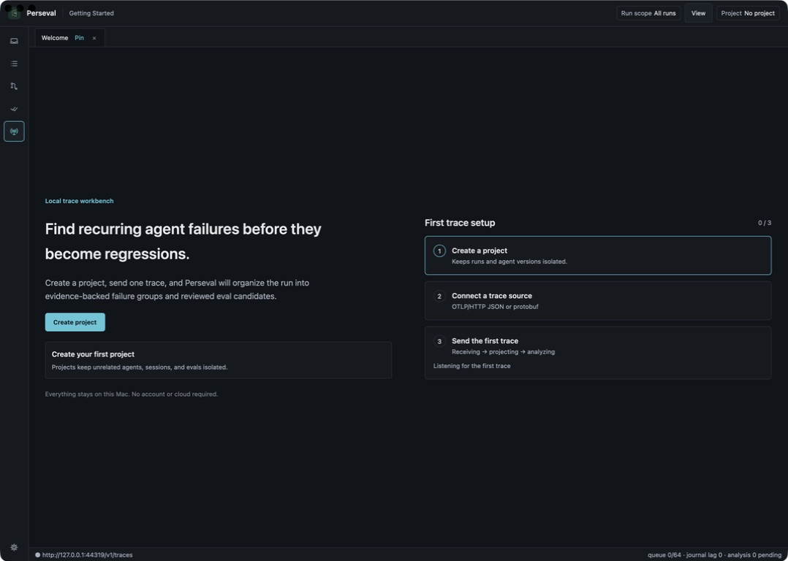

### Sources

Bring traces in without changing how your agent already runs. Stream OTLP/HTTP
JSON or protobuf to the loopback receiver, import a bounded trace file, or load
deterministic demo traces.

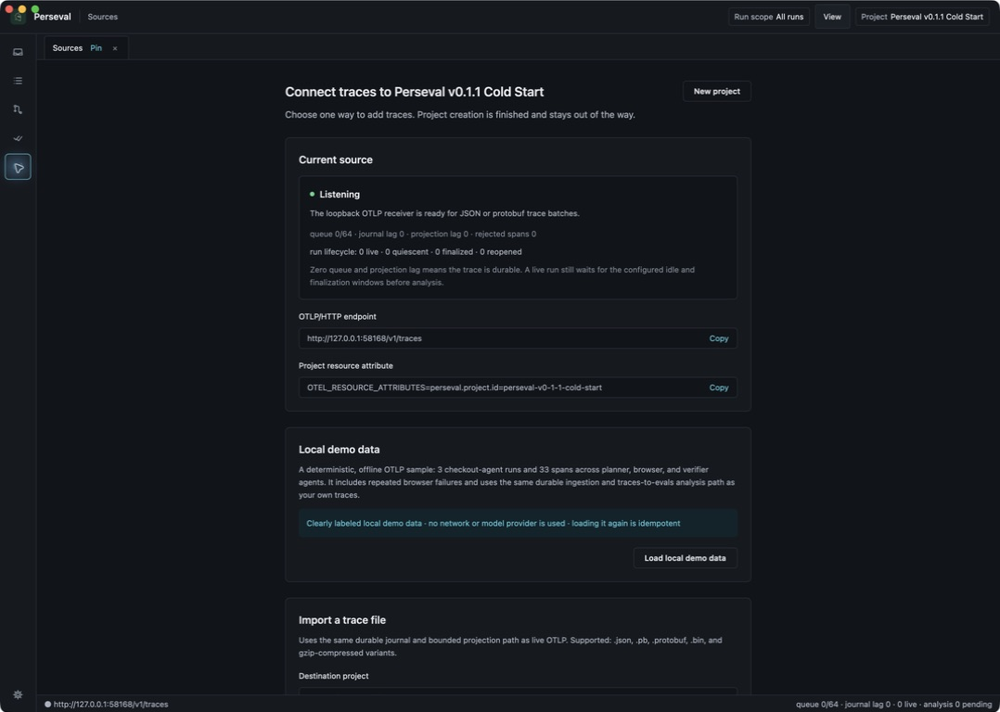

Use the **Project** control in the header to switch projects, open a read-only
all-projects view, create another project, or manage the selected project's
trace sources.

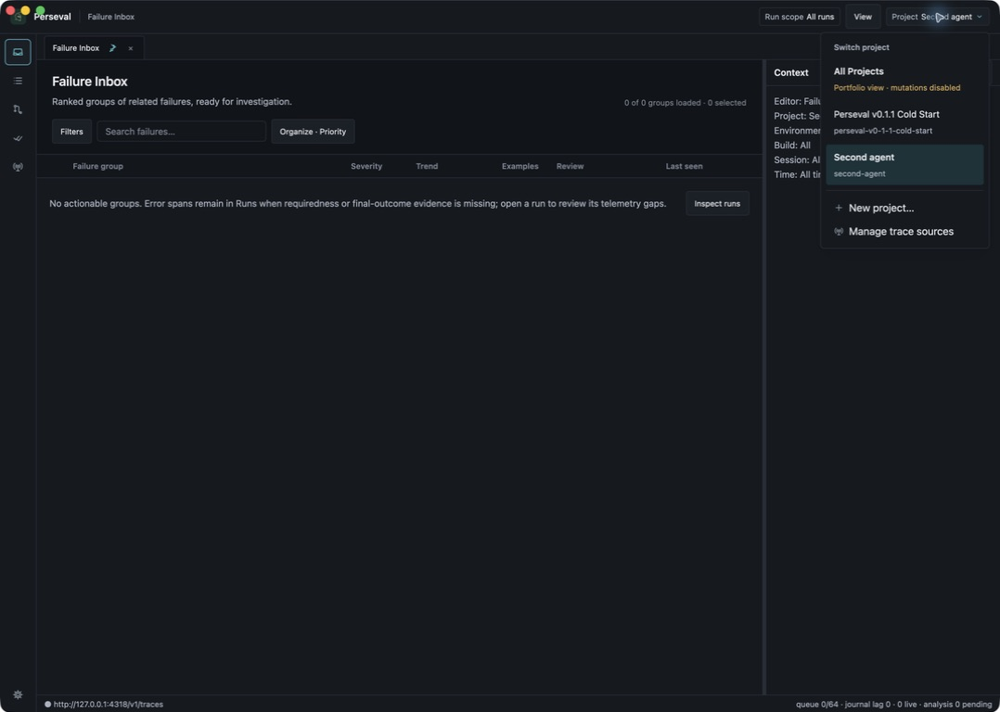

### Runs

Stop guessing which agent version produced a bad result. Perseval keeps
finalized runs separated by session, build, environment, lifecycle, and
identity, with bounded filtering over the persisted workspace.

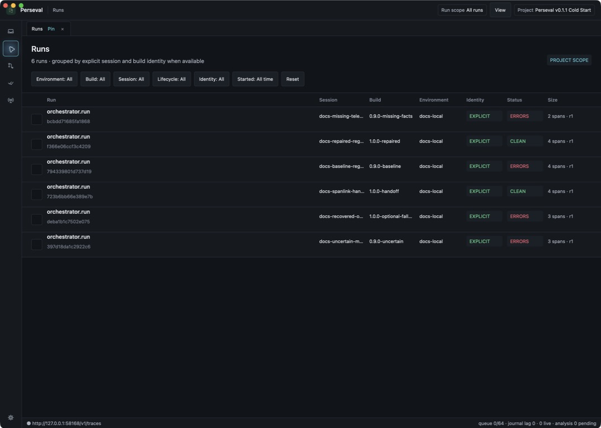

### Failure Inbox

Know which problems deserve attention first. Exact deterministic signatures
group related findings, while severity, denominator-backed recurrence, trends,
review state, and representative examples show their impact across runs.

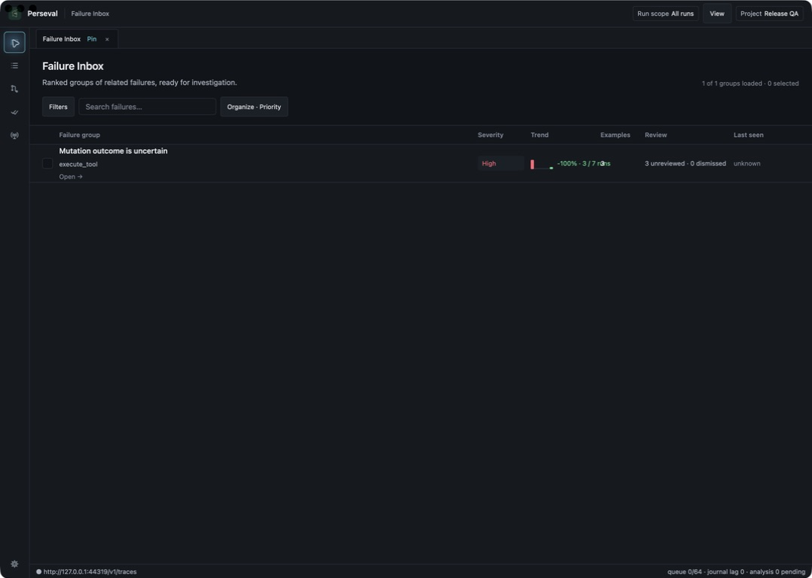

### Investigation

Understand why a failure happened without reading the entire trace. Detector
diagnoses connect expected, observed, impact, and recovery behavior to ordered
evidence spans and bounded execution context.

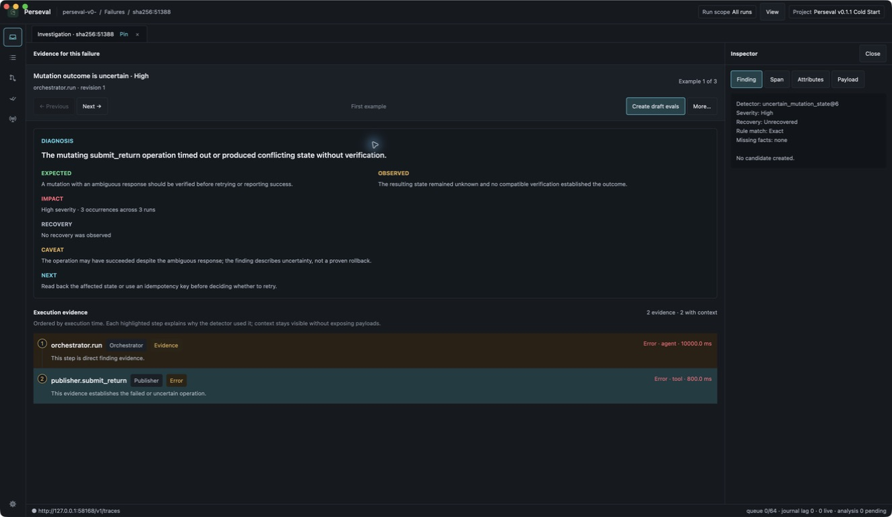

### Full Trace

Follow the complete chain of agent decisions and handoffs when the summary is
not enough. Perseval expands persisted topology lazily while keeping planner,
browser, verifier, model, tool, SpanLink, and evidence roles visible.

See where the run spent its time and how agent work overlapped. The same loaded
spans switch into a duration-aligned timeline without reconstructing or
reloading the trace.

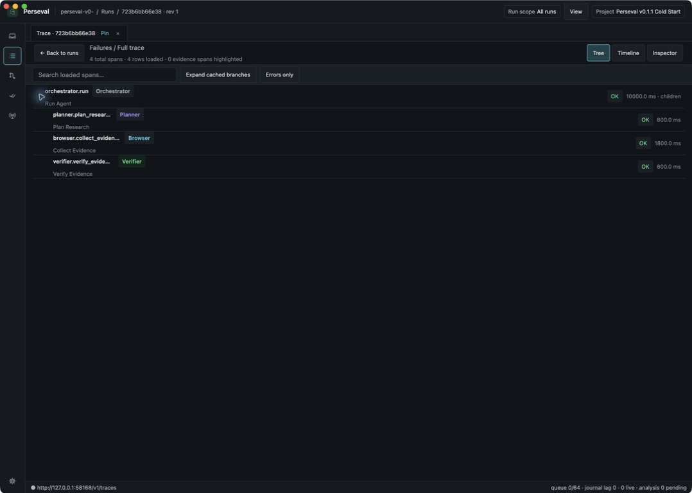

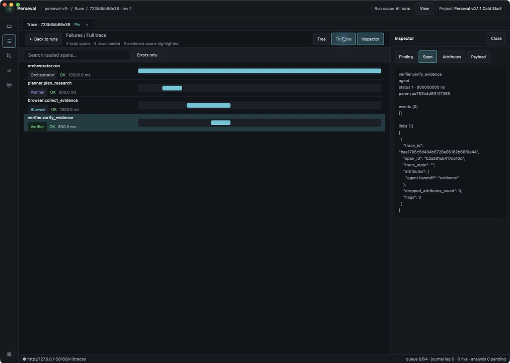

### Evals

Turn a real failure into a behavior definition your team can review and reuse.
Perseval generates draft eval definitions from representative findings, with
expected behavior, graders, evidence references, immutable provenance, and
explicit human approval.

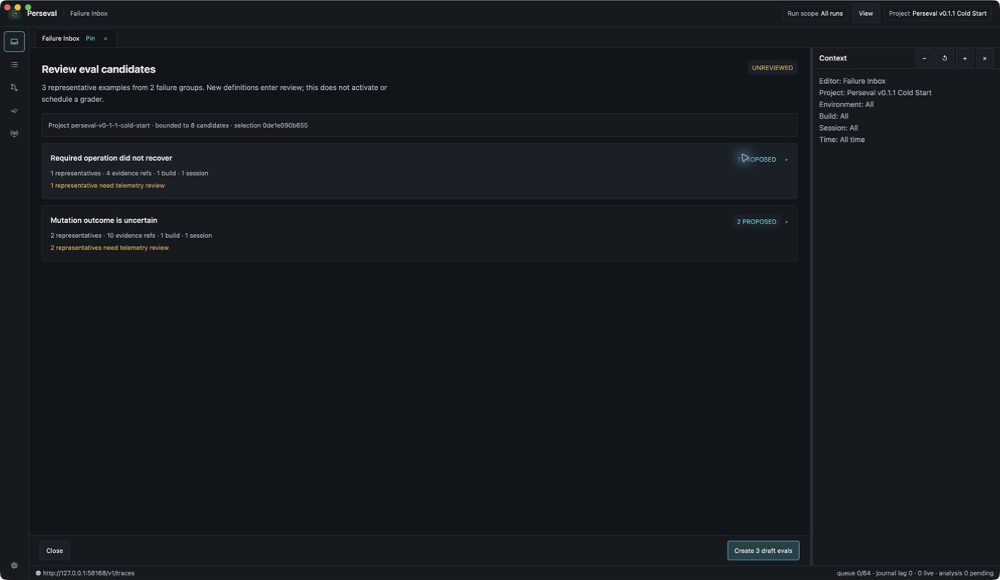

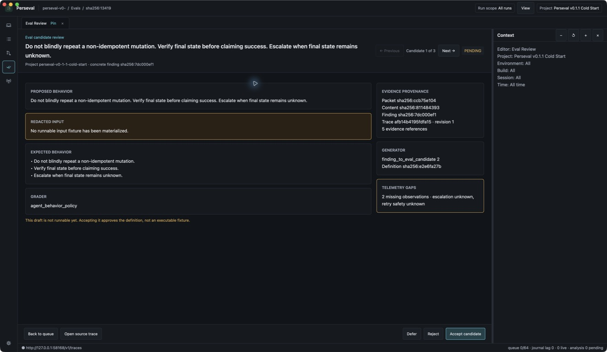

### Learned quality checks

Run a versioned Task Completion review over finalized trace revisions without
turning model output into a deterministic finding. The native **Evals**
workspace separates the quality-check definition, bounded backfill preview,
provider execution, human review, and calibration policy so each artifact keeps
its own immutable provenance.

**Review Queue** supports two intentionally different workflows. Blind
calibration seals the automated output and peer answers until the reviewer has
submitted an answer and evidence. Visible triage reveals the automated output
for investigation, but its answers are excluded from agreement and calibration.
Every review remains bound to the exact trace revision. After opening that
frozen trace, choose **Reviews** in the inspector to open each cited span.

**Calibration** reports held-out confusion, agreement, Brier score, reliability,
abstention, risk/coverage, and slices. A threshold policy materializes new
immutable assessment decisions; it never rewrites the underlying assessment.
Automation stays blocked until all displayed sample, agreement, precision, and
negative-predictive-value gates pass.

See [Learned Task Completion](LEARNED_TASK_COMPLETION.md) for the shipped
workflow, safety boundaries, and current limits.

### Compare

See whether a code, model, or prompt change actually changed agent behavior.
Perseval aligns two execution DAGs step by step, identifies their first
meaningful divergence, and reports explicitly when no divergence is found.

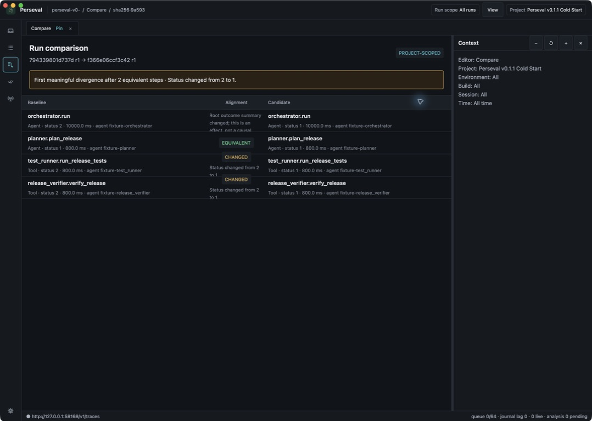

### Settings

Keep control of what Perseval stores, reveals, and sends to optional providers.
Editable workspace policy covers retention, payload previews, local reveal,
accessibility, and OpenAI provider readiness.

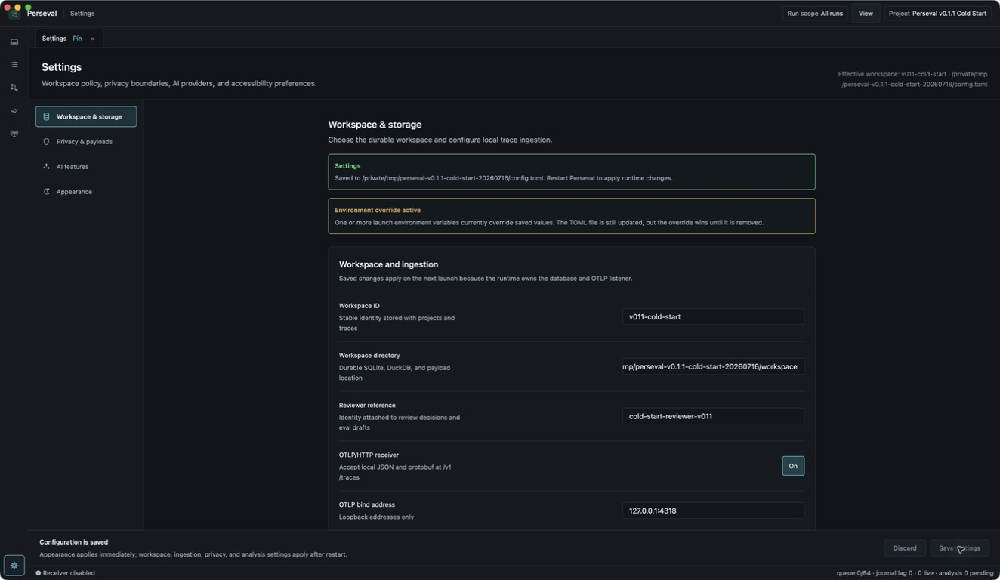

## Run Perseval

Download the [latest macOS build](https://github.com/Etolith/perseval/releases/latest/download/Perseval-macOS.zip), unzip it, and move `Perseval.app` to Applications. Perseval requires macOS 13 or newer; end users do not need Rust or Xcode.

The current beta is ad-hoc signed. On first launch, macOS may ask you to approve it in **System Settings → Privacy & Security**, or you can Control-click the app and choose **Open**.

Open Perseval, create a project, then load the local demo from **Sources**. This gives you a complete planner/browser/verifier investigation without configuring an exporter first.

Perseval always opens its persisted local workspace. Live OTLP ingestion stays disabled until you enable it in **Settings**, so installing the app does not open a listener by itself.

### Stream traces with OTLP

Watch new agent behavior arrive while the application is running. Enable OTLP in **Settings**, restart Perseval when prompted, open **Sources**, create a project, and copy the displayed endpoint and project resource attribute into your agent configuration.

Perseval accepts OTLP/HTTP protobuf and JSON on your machine at
`http://127.0.0.1:4318/v1/traces`.

If port 4318 is occupied, Perseval keeps the workbench open, chooses an available loopback port, and shows the effective endpoint in **Sources** and the status bar. Always copy that displayed endpoint instead of assuming the default.

```bash
OTEL_TRACES_EXPORTER=otlp \
OTEL_EXPORTER_OTLP_ENDPOINT=http://127.0.0.1:4318 \
OTEL_RESOURCE_ATTRIBUTES=perseval.project.id=<stable-project-id> \
your-agent-command
```

The Sources screen provides copy buttons for the effective endpoint and exact
project attribute. A project represents one agent application; sessions and
build versions remain dimensions inside that project.

Every acknowledged OTLP batch is durably journaled before analysis. Finalized
runs then become available for failure grouping, comparison, and eval
generation.

### Instrument once, diagnose precisely

Give Perseval enough context to distinguish a real agent failure from a noisy
tool error or expected fallback. It maps standard OpenTelemetry GenAI and
OpenInference fields, then uses a small set of behavioral attributes for exact
failure detection.

| Purpose | Recommended span or resource attributes |
|---|---|
| Project routing | `perseval.project.id=<stable-project-id>` |
| Session and build identity | `gen_ai.conversation.id`, `service.version` |
| Agent and operation identity | `gen_ai.agent.id`, `gen_ai.tool.name`, `agent.operation` |
| Required versus optional work | `agent.tool.requirement=required\|optional` |
| Tool result | `tool.result.success=true\|false` plus the OTel span status |
| Mutation and retry safety | `agent.operation.effect`, `agent.operation.retry_safety` |
| Observed state | `agent.state.predicate`, `agent.state.observation` |
| Root outcome | `agent.final.status=completed\|failed` |

Mark relevant tool calls as required or optional and describe mutation,
retry-safety, and observed state when available. Perseval surfaces missing facts
as telemetry gaps instead of inventing certainty. The reference trace generator
demonstrates the complete contract.

### Discover related failure patterns locally

Find failures that look different on the surface but share the same underlying
shape. Exact deterministic signatures remain canonical, while an optional local
feature projection and seeded K-means layer reveal secondary cohorts across
groups:

```toml
[analysis]
feature_similarity_enabled = true
minimum_findings = 3
```

Save that configuration and launch with
`PERSEVAL_CONFIG=/absolute/path/to/config.toml`. Similarity runs locally, never
reads raw payload blobs, and remains secondary to exact failure signatures.

### Opt into OpenAI analysis

Add human-readable cohort names and semantic review when local features alone
are not enough. Perseval exposes the sibling crate's OpenAI embeddings, cluster
labels, and semantic behavior judge behind a second, explicit opt-in; merely
setting an API key never enables a provider call:

```toml
[analysis]
feature_similarity_enabled = true

[analysis.openai]
enabled = true
embeddings_enabled = true
cluster_labels_enabled = true
semantic_judge_enabled = true
embedding_model = "text-embedding-3-small"
chat_model = "gpt-5-mini"
```

Launch Perseval with `OPENAI_API_KEY` in its environment. The key is never
written to TOML, SQLite, DuckDB, or blob storage. Embeddings and labels receive
only the versioned `SafeFindingProjector` representation. The semantic judge
uses the `StructuredOnly` behavior projection: it never receives raw payload
blobs, prompts, reasoning, source code, tool payloads, inputs, or outputs.
Judgments that require omitted content are review-only rather than actionable.

Hosted analysis is additive. Exact deterministic groups remain canonical,
K-means still fits locally, and a missing key or provider failure leaves
deterministic analysis usable. Settings shows provider readiness, running and
completed jobs, and a sanitized degraded state.


### Investigate with Codex or any MCP client

Perseval's MCP server makes the committed workspace available to coding agents
without copying trace JSON into a prompt. An agent can:

- find the sessions and runs with the most failures;
- rank recurring failure groups by priority, frequency, or recent increase;
- inspect one concrete finding with its telemetry gaps and provenance;
- retrieve the bounded evidence trace and surrounding execution context; and
- read durable eval-generation jobs and verification reports.

That enables an investigation loop such as:

1. Find the candidate build's highest-priority failure group.
2. Inspect a representative occurrence.
3. Retrieve the cited spans and explain the first unsupported action.
4. Open the same run or failure group in the native workbench for visual review.

Every response comes from committed, versioned projections. Raw payload bodies
remain unavailable through the default read-only configuration.

Register the MCP executable bundled with the installed application in Codex, Claude, or any other MCP-compatible client. It uses stdio and never opens another OTLP listener.

Example client configuration:

```json
{
  "mcpServers": {
    "perseval": {
      "command": "/Applications/Perseval.app/Contents/Resources/perseval-mcp",
      "env": {
        "PERSEVAL_MCP_READ_ENABLED": "true"
      }
    }
  }
}
```

When the GUI owns the workspace, MCP clients are routed through its private
user-only local socket. Live ingestion, the native workbench, and multiple agent
investigators can therefore use the same workspace safely.

If the GUI uses a custom workspace, add the same `PERSEVAL_WORKSPACE_DIR` value to the MCP client environment.

Example questions to ask after connecting:

- "Which runs have the most findings in this project?"
- "Show me the failure groups with the largest recent increase."
- "Inspect the top occurrence and explain each cited evidence span."
- "What telemetry is missing before this finding can be considered conclusive?"

### Build the macOS application

Contributor builds require Xcode Command Line Tools and the Rust toolchain pinned by `rust-toolchain.toml`:

```bash
scripts/package-macos-app.sh
open target/macos/Perseval.app
```

Set `PERSEVAL_BUILD_PROFILE=debug` for a faster local build or
`PERSEVAL_CODESIGN_IDENTITY` to provide a distribution identity.

## Repository layout

```text
apps/perseval-app        Native desktop application
crates/perseval-ingest   OTLP/HTTP ingestion
crates/perseval-store    Local storage and analyzed data
crates/perseval-service  Application logic and background jobs
crates/perseval-mcp      MCP integration
tools/perseval-bench     Scale and detector qualification tooling
```

Perseval pins the public `traces-to-evals` engine to an immutable Git revision.

## Verify

```bash
cargo fmt --all -- --check
cargo clippy --workspace --all-targets -- -D warnings
cargo test --workspace
```

Try the end-to-end demo, connect traces from your own agent, or help shape the
next investigation workflow.
Contribution and private
security-reporting guidance are in [`CONTRIBUTING.md`](CONTRIBUTING.md) and
[`SECURITY.md`](SECURITY.md).

Perseval is free software licensed under GPL-3.0-or-later. See [LICENSE](https://github.com/Etolith/perseval/blob/main/LICENSE).
